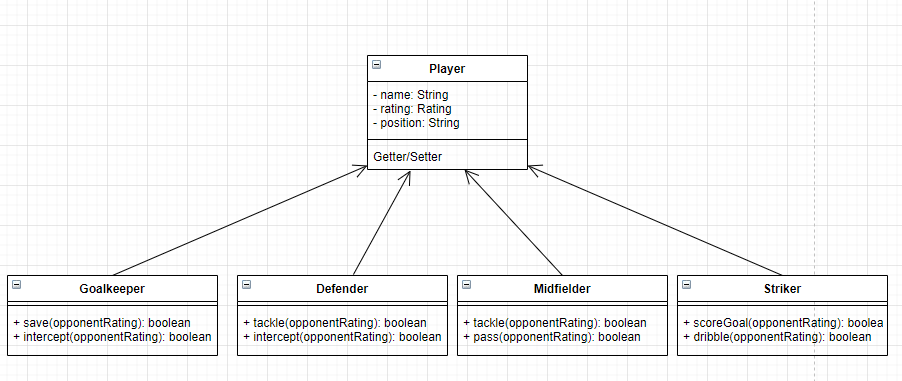

# SL_Simulator
Simulates the Super League 

Der Super League Simulator ist eine Applikation, die alle 10 schweizer Fussballmannschaften
gegenüberstellt. Mit vorgegebenen Werten wird von den einzelnen Spieltagen bis zur ganzen Season simuliert und dem User ausgegeben.

[Jump to documentation for 226b](#226b---extending-things)

## Design
#### Kick Off Class Diagram

 Nach recherchen und austausch mit dem Klassenlehrer Herr Pangri, zeichnete ich grob die wichtigsten Klassen in einem Klassendiagramm auf.

#### Use Case Diagram

 Mein Programm hat das Ziel die Liga zu simulieren und danach auszugeben, daher gibt es eigentlich nur einen Use Case.
Um auch die Frage zu beantworten, wie lange ein Team braucht um die Liga zu gewinnen, gibt es alternativ noch die Möglichkeit die Liga so lang zu simulieren, bis da Team an der Spitze ist.

## Planung & Umsetzung
Der Kern des Projekts ist die Match Engine. Ich hatte verschiedene Varianten wie ich die Bewertung der Teams lösen konnte:  
mit einem einzelnen Wert (z.B das Fifa Rating), mit mehreren Werten(z.B einen für Offensive, einen für Defensive), mit elf Werten pro Mannschaft representativ für die 11 Spieler.
Ich stieg mit dem einzelen Wert ein. Den Wert entnahm ich gleich dem Fifa Spiel. Der beste Wert hatte YB mit 71, den schlechtesten Lausanne mit 66.  
Die Resultate waren nicht wie gewünscht. Die Ligatabellen waren sehr zufällig. Die Werte waren zu nah bei einander. Weiter machte es keinen Sinn mit einer Skala von 100 
zu Arbeiten wenn ich in einer geschlossen Liga simuliere die ja für sich ist.  
Ich entschied mich für die zweite Variante. Jedes Team erhielt auf der Skala 0-10 einen Wert für die Offensive und die Defensive. 
Nach ein Paar Tests waren die Ergebnisse vielverprechend. YB wurde oft Meister, aber auch der FC Zürich konnte hin und wieder mal brillieren.
Ich passte die Werte immer wieder an bis es für meine Wahrnehmung der Super League stimmte.
  
In der gegenüberstellung der Teams an einem Spieltag musste ich kreativ werden.
Zuerst gab ich den Team eine Tagesform mit, die ihres Rating um 2 nach oben oder unten schraubt.
Danach erhielten beide Team sechs Chancen ein Tor zu erzielen. Während diesen Chances
lies ich sowohl das Rating des stürmenden Team, so wie auch das des verteidigenden Teams mit einfliessen. 
Aber ein wenig Zufall musste auch dabei sein. Sonst hätten die schlechteren Team gar keine Chance.
  
Sobald die Match Engine so stand und diverse Resultate lieferte, konnte ich mich an die Details setzten.
Ich nahm einen User Input in Form eines Lieblingsteams entgegen, gab die Möglichkeit die Liga so viel wie man will auf ein Mal zu simulieren und gab natürlich die Schlusstabelle in der Konsole aus.

#### Sequence Diagram

#### Class Diagram Final Product

## Testing
Beim Testing priorisierte ich die wichtigsten Methoden meines Programms: die Match Engine und die Ligatabelle 
Ich beantwortete die wichtigsten Fragen:  
Gewinnt in der Regel das stärke Team? 
Werden die Punkte richtig verteilt? 
Funktioniert die Sortierung nach den festgelegten Regeln? 

Die Test waren Erfolgreich und bestätigten ein sauberes Arbeiten.

 

## Fazit
Die Arbeit an diesem Projekt hat mir grossen Spass bereitet. Besonders das Anpassen der Daten und darauf die Simulation wieder und wieder laufen zu lassen war sehr Spannend.

# 226b - Extending things

Für das Folgemodul 226b wurde der Super League Simulator mit Spieler Klassen erweitert und vererbung wurde eingesetzt. 
Ziel war es die Match Engine umzuschreiben, so dass Spieler gegen Spieler antreten anstatt nur Mannschaften als ganzes.

 Die Erweiterung des Simulators wurde zusammen mit Jonas Baars geschrieben.

## Design

Als Erstes wurde eine Art Idee-Klassendiagram erstellt. Wichtig war uns die Vererbung darzustellen. Player ist der Parent von dem alle
Spielerpositionen erben und je nach dem andere Methoden verwenden. Ein Interface wird daher nicht verwendet. Jede Position
hat unterschiedliche Methoden aber teilen über den Parent "Player" Gemeinsamkeiten. So haben wir die Vererbung eingebaut. Die [Use Case](#use-case-diagram) vom
ersten Teil können so übernommen werden. Nach vorne ändert sich nicht so viel wie im Hintergrund z.B in der Match Engine.

## Planung & Umsetzung
Die Planung wurde im Github mit einem Art Kanban Diagram gemacht. So konnten wir bequem Aufgaben verteilen und verfolgen.
In der Umsetzung war sicher die grössten zwei Herausforderung das Refactoring des JSONReaders und das Umschreiben der Match Engine.
 
Beim JSONReader kostete die Verschachtelung von Team und Player viel Zeit. Mit einem Online Tool konnten wir jedoch eine
gute Vorlage für unseren Reader generieren lassen, das JSON File mit allen Spielern und Mannschafften hatten wir ja bereits schon.
 
Das Refactoring der Matchengine wurde durch kleine Logikfehler immer wieder in die Länge gezogen worden. Als Beispiel: Die
involvierten Spieler erhielten zufälligerweise ein Rating Zuwachs oder Minderung vor dem Spiel. Jedoch wurde dies am Anfang nicht wieder am Anfang wieder zurückgesetzt.
So gab es bei der gegenüberstellung Fehlermeldungen da ein Spieler plötzlich im Rating über dem Maximal Wert 10 lag.  
Dank genauem Debugging wurde aber schnell klar was das Problem war. 

## Testing
Mit den bereits vorhanden Tests vom letzten Modul konnten wir ideal kontrollieren ob wir sauber gearbeitet haben.
Einige Tests mussten jedoch umgeschrieben werden, angepasst an die umgeschriebenen Klassen.  
Zusätzlich kam lediglich die Testcases für die einzelnen Positionen.

### Sequence Diagram

### Class Diagram of Refactoring/New Classes in "226b"

Für die Erweiterung wurde einiges Refactored und kam neu dazu. Die Veränderungen und neuen Klassen haben wir hier mit draw.io
abgebildet. Unveränderte Klassen sind im "alten" [Klassendiagramm](#class-diagram-final-product)
zu finden.

## Fazit
Das Erweitern dieses Projekts war eine Herausforderung. Es machte Spass zu Zweit daran zu arbeiten und die Arbeit aufzuteilen.
So konnte jeder das machen was er am besten kann. Obwohl von aussen sich nicht viel verändert hat, sind wir stolz auf die 
schnell Implementation von einzelnen Spielern vs. ganze Mannschaften mit Vererbungen.

## Genrali ProjektZeit
-	Ziel und Nutzen der Applikation  
Simulation der Superleague mit so realistische Daten wie möglich (FM, Elo Score) - for fun
-	UseCases mit Akteuren und System  
-	MVP (Welche Features müssen implementiert werden, damit die Applikation überhaupt ihre Berechtigung hat)  
Ein GUI mit einfacherer Handhabung + FM Attribute pro Spieler
-	Die Lernziele, die ihr damit erreichen wollt  
Daten visualisieren
-	Zeitplan mit Meilensteinen  
Ende September erste Version
-	Eine Aufwandschätzung wie viele Arbeitstage ihr investieren müsst, um das Projekt (oder auch nur das MVP) fertig zu stellen  
5-7 Arbeitstage
-	Welche Technologien und Framework wollt ihr dazu einsetzen.  
NextJS, Java usw.

